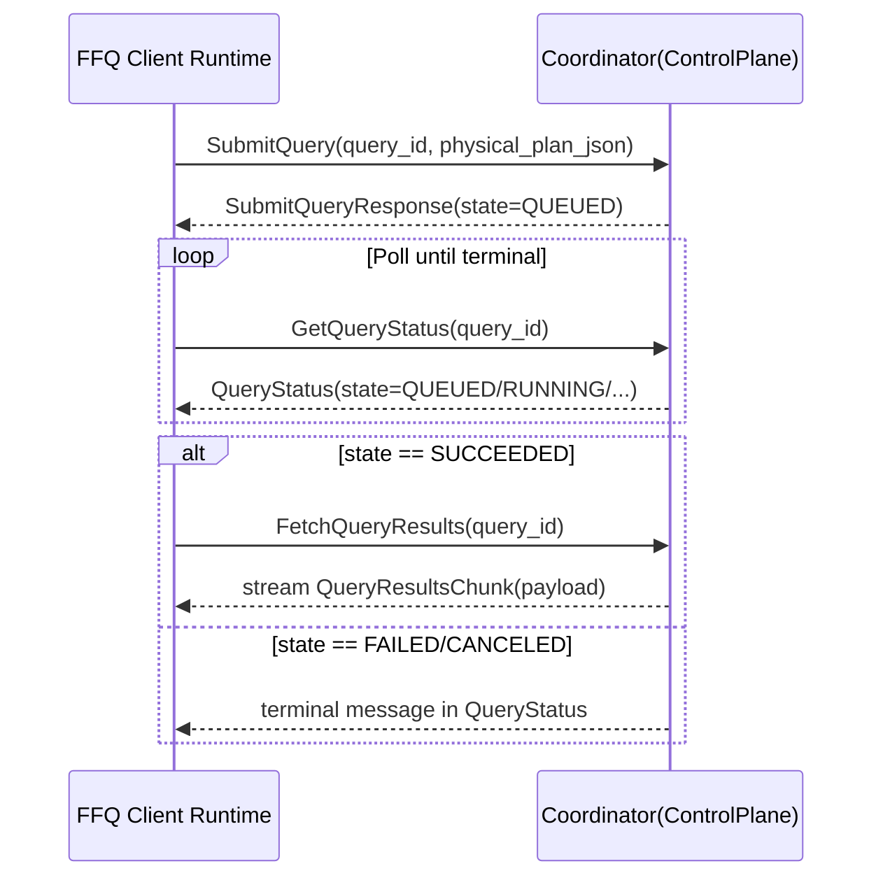
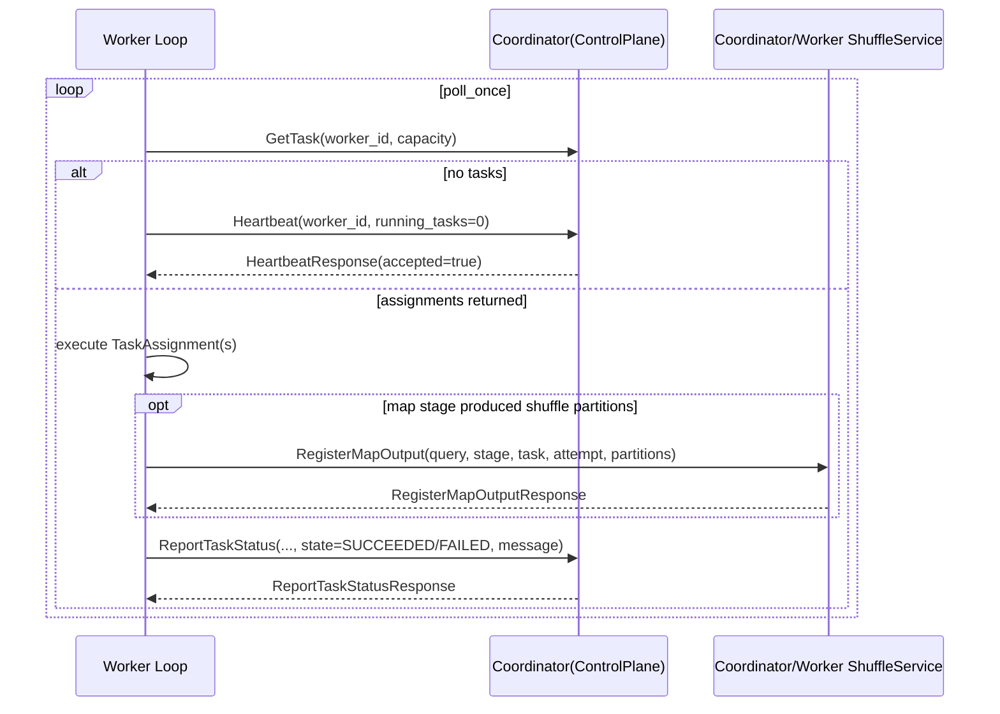
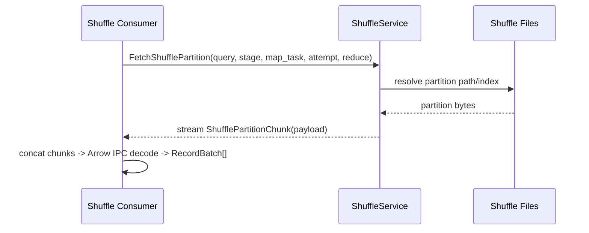
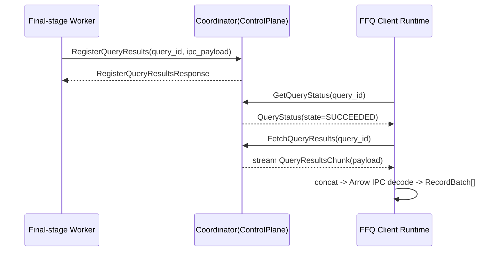

# LEARN-08: gRPC Protocol and Data Exchange

This chapter explains FFQ's distributed gRPC protocol from a learner perspective: what each RPC does, how calls are sequenced, and how bytes move for shuffle/results.

## 1) Protocol Surface

Proto source:

1. `crates/distributed/proto/ffq_distributed.proto`

Services:

1. `ControlPlane`
2. `ShuffleService`
3. `HeartbeatService`

## 2) RPC Purpose by Method

### Control-plane lifecycle RPCs

1. `SubmitQuery`
   - client submits `physical_plan_json` + `query_id`.
   - coordinator validates/records query and returns initial query state.
2. `GetTask`
   - worker pulls task assignments using `worker_id` + `capacity`.
   - response is a list of `TaskAssignment` entries with plan fragment bytes.
3. `ReportTaskStatus`
   - worker reports `{query_id, stage_id, task_id, attempt, state, message}`.
   - coordinator updates task/query state machine and metrics.
4. `GetQueryStatus`
   - client polls query state transitions and terminal message.
5. `CancelQuery`
   - requester asks coordinator to cancel query with reason.
   - coordinator returns updated terminal state.

### Data/result RPCs

1. `RegisterMapOutput` (`ShuffleService`)
   - worker reports produced reduce-partition metadata for map stage attempt.
2. `FetchShufflePartition` (`ShuffleService`, server-streaming)
   - consumer fetches partition bytes for `{query, stage, map_task, attempt, reduce_partition}`.
3. `RegisterQueryResults`
   - final-stage worker registers full final-result IPC payload on coordinator.
4. `FetchQueryResults` (server-streaming)
   - client receives final query result bytes as chunk stream.

### Liveness RPC

1. `Heartbeat`
   - worker sends periodic liveness/capacity signal (`worker_id`, timestamp, running tasks).
   - v1 coordinator currently acknowledges but does not enforce lease timeout logic.

## 3) Data Exchange Contracts

### 3.1 Plan submission payload

`SubmitQueryRequest.physical_plan_json`:

1. serialized physical plan bytes
2. decoded by coordinator before scheduling

### 3.2 Task assignment payload

`TaskAssignment.plan_fragment_json`:

1. serialized plan fragment bytes (v1 currently carries submitted physical plan bytes)
2. worker decodes this and executes by stage context

### 3.3 Shuffle payload

`FetchShufflePartition` stream:

1. each message is `ShufflePartitionChunk { payload: bytes }`
2. payload chunks are concatenated by receiver
3. concatenated bytes decode as Arrow IPC stream for that partition

### 3.4 Final query result payload

`FetchQueryResults` stream:

1. each message is `QueryResultsChunk { payload: bytes }`
2. client concatenates all chunks
3. concatenated bytes decode as Arrow IPC stream of final batches

## 4) Query Submission Sequence

Implementation references:

1. client polling/result fetch: `crates/client/src/runtime.rs`
2. coordinator RPC handlers: `crates/distributed/src/grpc.rs`

## 5) Worker Task Loop Sequence

Implementation references:

1. worker loop/control-plane calls: `crates/distributed/src/worker.rs`
2. coordinator status handling: `crates/distributed/src/coordinator.rs`

## 6) Shuffle Partition Fetch Sequence

Important v1 details:

1. attempt is part of fetch identity.
2. worker shuffle gRPC supports `attempt==0` as latest-attempt sentinel.
3. unknown/unregistered attempt returns explicit error.

## 7) Result Return Sequence

## 8) Cancel Flow

`CancelQuery` semantics:

1. caller sends `CancelQueryRequest { query_id, reason }`
2. coordinator updates query state to `CANCELED`
3. future `GetQueryStatus` reports canceled state
4. client distributed runtime treats canceled as terminal error

Note:

1. v1 cancellation is coordinator-state based; deep in-flight task preemption behavior is intentionally minimal.

## 9) Error Mapping and Status Semantics

gRPC layer maps domain errors (`FfqError`) to RPC status:

1. `InvalidConfig` -> `invalid_argument`
2. `Planning` -> `failed_precondition`
3. `Execution`/`Io` -> `internal`
4. `Unsupported` -> `unimplemented`

This mapping is implemented in `crates/distributed/src/grpc.rs` (`to_status`).

## 10) Why This Protocol Design Works (v1)

Correctness points:

1. explicit IDs (`query/stage/task/attempt`) disambiguate every mutable event.
2. pull scheduling (`GetTask`) gives workers backpressure control.
3. map output registration separates "task finished" from "shuffle data visible".
4. server-streaming for shuffle/results avoids single giant response payloads.

Fault-tolerance assumptions:

1. clients/workers retry RPCs at call-site or next poll loop.
2. coordinator in-memory state is authoritative for active query lifecycle.
3. attempt-based keys prevent stale output confusion when retries occur.
