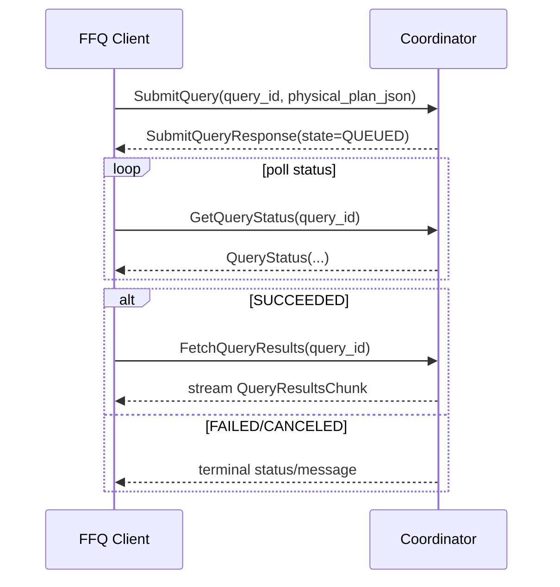
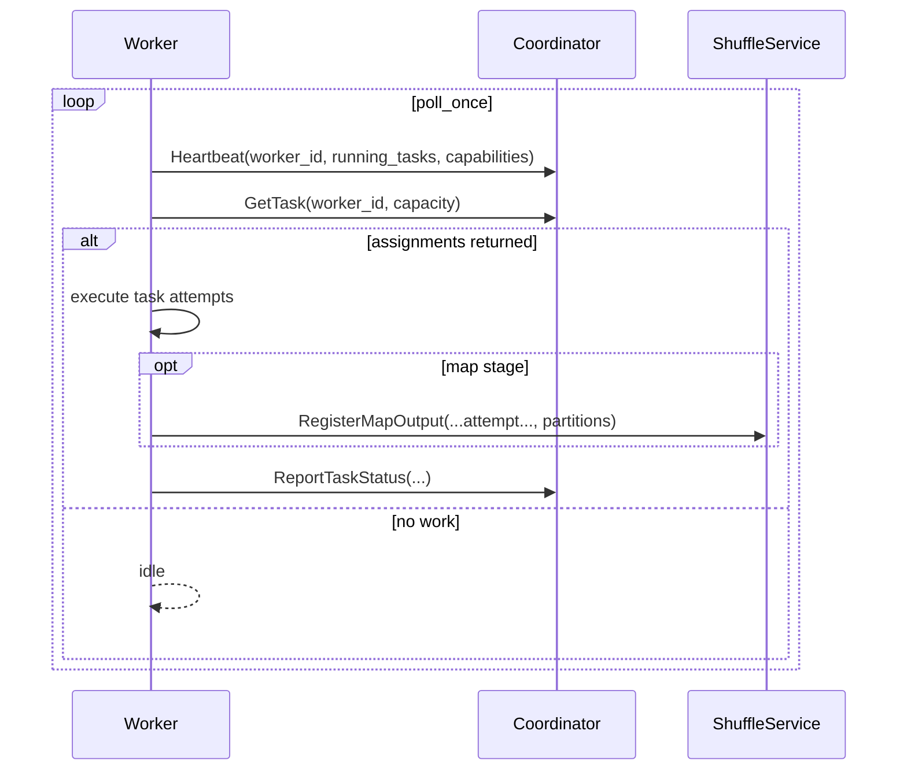

# LEARN-08: gRPC Protocol and Data Exchange

This chapter explains FFQ distributed gRPC protocol in v2: what each RPC does, how calls are sequenced, and how capability/liveness signals affect scheduling.

## 1) Protocol Surface

Proto source:

1. `crates/distributed/proto/ffq_distributed.proto`

Services:

1. `ControlPlane`
2. `ShuffleService`
3. `HeartbeatService`

## 2) RPC Purpose by Method

### Control-plane lifecycle RPCs

1. `SubmitQuery`
   - submit serialized physical plan + query id
2. `GetTask`
   - worker pulls assignments with `worker_id` and `capacity`
3. `ReportTaskStatus`
   - worker reports attempt state transition
4. `GetQueryStatus`
   - client polls query lifecycle state
5. `CancelQuery`
   - cancel queued/running query

### Result and shuffle RPCs

1. `RegisterMapOutput`
   - worker registers map partition metadata for exact attempt
2. `FetchShufflePartition` (stream)
   - fetch partition bytes by `(query, stage, map_task, attempt, reduce_partition)`
3. `RegisterQueryResults`
   - final-stage worker uploads final result IPC payload
4. `FetchQueryResults` (stream)
   - client reads final result payload in chunks

### Heartbeat RPC

1. `Heartbeat`
   - worker reports liveness plus capability metadata

## 3) Heartbeat Payload Contract (Important)

`HeartbeatRequest` carries:

1. `worker_id`
2. `at_ms`
3. `running_tasks`
4. `custom_operator_capabilities`

Coordinator uses heartbeat data actively:

1. liveness timeout / stale worker detection
2. capability-aware filtering in `GetTask`

This is not advisory-only behavior.

## 4) Query Submission Sequence



## 5) Worker Task Loop Sequence



## 6) Capability-Aware Routing Over RPC

Custom operator tasks are represented in plan fragments with required operator names.

Coordinator routing behavior on `GetTask`:

1. if task has no required custom ops: no capability constraint
2. if task has required custom ops: assign only when heartbeat capability set covers all required names

If no worker matches:

1. assignment is withheld
2. task remains queued

## 7) Failure and Recovery Semantics Over RPC

### Task failure path

1. worker sends `ReportTaskStatus(..., Failed, message)`
2. coordinator increments worker failure counter
3. retry is enqueued with backoff (if attempts remain)
4. worker may be blacklisted on repeated failures

### Liveness failure path

1. no heartbeat beyond timeout -> worker considered stale
2. coordinator requeues running tasks from stale worker as new attempts
3. subsequent `GetTask` can assign retries elsewhere

## 8) Data Payload Contracts

### Plan payloads

1. `SubmitQueryRequest.physical_plan_json`
2. `TaskAssignment.plan_fragment_json`

### Shuffle payloads

1. `ShufflePartitionChunk.payload` bytes are streamed and concatenated by receiver

### Final result payloads

1. `QueryResultsChunk.payload` bytes are streamed and concatenated by client

All payloads use deterministic id keys (`query/stage/task/attempt`) to avoid stale-attempt ambiguity.

## 9) Error Mapping

gRPC layer maps domain errors to status codes in `crates/distributed/src/grpc.rs`.

Examples:

1. invalid config -> `invalid_argument`
2. planning errors -> `failed_precondition`
3. execution/io errors -> `internal`
4. unsupported path -> `unimplemented`

## 10) Code References

1. `crates/distributed/proto/ffq_distributed.proto`
2. `crates/distributed/src/grpc.rs`
3. `crates/distributed/src/coordinator.rs`
4. `crates/distributed/src/worker.rs`

## Runnable commands

```bash
cargo test -p ffq-distributed --features grpc coordinator_assigns_custom_operator_tasks_only_to_capable_workers
cargo test -p ffq-distributed --features grpc coordinator_requeues_tasks_from_stale_worker
```
