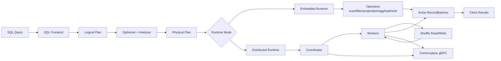

# FFQ Learner Guide

This guide is the concept-first path for understanding FFQ end-to-end.
It is separate from runbooks and reference docs: the goal here is to explain why FFQ works, not only how to run commands.

## Mental Model Map



What this means in plain terms:

1. FFQ always plans first (logical -> optimized -> physical).
2. The same physical semantics are used in embedded and distributed modes.
3. Distributed mode adds orchestration (coordinator/workers/shuffle), not a different SQL meaning.
4. Results come back as Arrow `RecordBatch` streams in both modes.

## Start Interactive SQL Quickly

Launch REPL with a catalog profile:

```bash
cargo run -p ffq-client -- repl \
  --catalog tests/fixtures/catalog/tpch_dbgen_sf1_parquet.tables.json
```

First query:

```sql
SELECT l_orderkey, l_quantity FROM lineitem LIMIT 5;
```

## Recommended Reading Order

Read these in sequence:

1. `docs/learn/01-query-lifecycle.md`
2. `docs/learn/02-optimizer-internals.md`
3. `docs/learn/03-physical-planning.md`
4. `docs/learn/04-execution-engine.md`
5. `docs/learn/05-distributed-stages-shuffle.md`
6. `docs/learn/06-control-plane.md`
7. `docs/learn/07-rpc-protocol.md`
8. `docs/learn/08-correctness-distributed.md`
9. `docs/learn/09-storage-catalog.md`
10. `docs/learn/10-vector-rag-internals.md`
11. `docs/learn/11-writes-commit.md`
12. `docs/learn/12-observability-debugging.md`
13. `docs/learn/13-extensibility-v2.md`
14. `docs/learn/14-runtime-portability-v2.md`
15. `docs/learn/15-api-bindings-v2.md`
16. `docs/learn/16-sql-semantics-v2.md`
17. `docs/learn/17-aqe-adaptive-shuffle-v2.md`
18. `docs/learn/18-join-system-v2.md`
19. `docs/learn/19-aggregation-v2.md`
20. `docs/learn/20-shuffle-distributed-v2.md`
21. `docs/learn/21-vector-rag-v2.md`
22. `docs/learn/labs/README.md`
23. `docs/learn/glossary.md`
24. `docs/learn/faq.md`
25. `docs/v2/quickstart.md`
26. `docs/v2/architecture.md`
27. `docs/v2/client-runtime.md`
28. `docs/v2/operators-core.md`
29. `docs/v2/storage-catalog.md`
30. `docs/v2/shuffle-stage-model.md`
31. `docs/v2/distributed-runtime.md`
32. `docs/v2/control-plane.md`
33. `docs/v2/vector-rag.md`
34. `docs/v2/writes-dml.md`
35. `docs/v2/observability.md`
36. `docs/v2/testing.md`
37. `docs/v2/benchmarks.md`

## What You Will Understand At The End

After finishing this path, you should be able to explain:

1. How SQL is turned into executable plans in FFQ.
2. Which optimizer rules are applied and when fallback happens.
3. How embedded execution differs from distributed execution.
4. How the coordinator and workers coordinate tasks over gRPC.
5. How shuffle boundaries, attempts, and cleanup keep distributed execution correct.
6. Why distributed outputs match embedded semantics for the same query.
7. How storage/catalog metadata enables query resolution.
8. How vector/rag routing decides between brute-force and index-backed execution.
9. How qdrant rewrite preconditions, projection contracts, and filter pushdown subset control routing.
10. How sink execution and commit semantics prevent partial writes and enable safe retries.
11. How to diagnose runtime issues from traces, Prometheus metrics, and profiling hooks.
12. How to run end-to-end labs for embedded, distributed, vector routing, and official benchmarks.
13. How to quickly resolve common failures using FAQ patterns and glossary terminology.
14. How runtime/portability feature flags and build profiles map to deployable capabilities.
15. How API contract, C ABI, Python bindings, and extensibility hooks fit one stable v2 surface.
16. How v2 SQL semantics (outer joins/CASE/CTE/subqueries/window) are defined and validated.
17. How AQE/adaptive shuffle decisions are made and validated (fanout, skew, barrier, retries).
18. How the join-system v2 stack (radix, bloom, sort-merge, semi/anti) changes plan/runtime behavior.
19. How aggregation v2 handles spill, distinct lowering, and approximate aggregate behavior.
20. How v2 shuffle/distributed runtime pipelining, streaming safety, and backpressure work in practice.
21. How v2 hybrid/vector retrieval APIs (hybrid node, batched search, embedding providers) fit runtime and planner behavior.
22. How to debug correctness/performance issues with metrics, traces, and benchmark artifacts.

## Deep-Dive Topics (Planned Learner Chapters)

The learner track expands next into dedicated chapters:

1. `docs/learn/01-query-lifecycle.md` (query lifecycle and plan lowering internals).
2. `docs/learn/02-optimizer-internals.md` (optimizer rule-by-rule walkthrough).
3. `docs/learn/03-physical-planning.md` (logical->physical mapping and operator contracts).
4. `docs/learn/04-execution-engine.md` (streaming, memory budget, spill, determinism internals).
5. `docs/learn/05-distributed-stages-shuffle.md` (stage cuts, shuffle paths, attempts, and TTL cleanup).
6. `docs/learn/06-control-plane.md` (state machine, pull scheduling, heartbeats, registry, blacklisting).
7. `docs/learn/07-rpc-protocol.md` (RPC purposes, call sequences, and streamed byte exchange).
8. `docs/learn/08-correctness-distributed.md` (semantic equivalence, normalization, and parity testing).
9. `docs/learn/09-storage-catalog.md` (table metadata, catalog persistence, and provider behavior).
10. `docs/learn/10-vector-rag-internals.md` (cosine kernels, top-k execution, qdrant rewrite and fallback).
11. `docs/learn/11-writes-commit.md` (DML planning, sink execution, temp-then-commit, and failure cleanup).
12. `docs/learn/12-observability-debugging.md` (trace/metrics/profiling signals and debugging workflows).
13. `docs/learn/13-extensibility-v2.md` (optimizer/UDF/custom-operator hooks and distributed bootstrap behavior).
14. `docs/learn/14-runtime-portability-v2.md` (feature matrix, build profiles, and distributed hardening checks).
15. `docs/learn/15-api-bindings-v2.md` (SemVer contract, C ABI, Python bindings, and acceptance checks).
16. `docs/learn/16-sql-semantics-v2.md` (EPIC 3 support matrix and correctness model for CTE/subquery/window semantics).
17. `docs/learn/17-aqe-adaptive-shuffle-v2.md` (EPIC 4 runtime stats, adaptive join/shuffle, skew handling, and diagnostics).
18. `docs/learn/18-join-system-v2.md` (EPIC 5 join architecture and validation model).
19. `docs/learn/19-aggregation-v2.md` (EPIC 6 aggregate architecture, spill model, and distinct/approx semantics).
20. `docs/learn/20-shuffle-distributed-v2.md` (EPIC 7 pipelined shuffle, stream protocol, backpressure, TTFR, and speculative execution concepts).
21. `docs/learn/21-vector-rag-v2.md` (EPIC 9 hybrid node/vector KNN knobs/batched query/embedding provider additions).
22. `docs/learn/labs/README.md` (hands-on exercises with expected outputs and troubleshooting).
23. `docs/learn/glossary.md` (shared vocabulary and links into deeper chapters).
24. `docs/learn/faq.md` (common failure diagnostics linked to root-cause chapters).
25. Benchmark interpretation (synthetic vs official).
