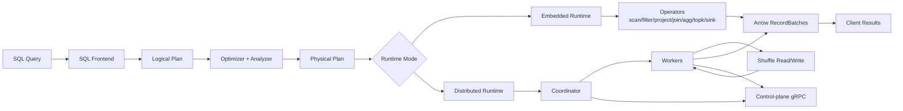

# FFQ Learner Guide

This guide is the concept-first path for understanding FFQ end-to-end.
It is separate from runbooks and reference docs: the goal here is to explain why FFQ works, not only how to run commands.

## Mental Model Map

What this means in plain terms:

1. FFQ always plans first (logical -> optimized -> physical).
2. The same physical semantics are used in embedded and distributed modes.
3. Distributed mode adds orchestration (coordinator/workers/shuffle), not a different SQL meaning.
4. Results come back as Arrow `RecordBatch` streams in both modes.

## Recommended Reading Order

Read these in sequence:

1. `docs/learn/01-query-lifecycle.md`
2. `docs/learn/02-optimizer-internals.md`
3. `docs/learn/03-physical-planning.md`
4. `docs/learn/04-execution-engine.md`
5. `docs/learn/05-distributed-stages-shuffle.md`
6. `docs/v1/quickstart.md`
7. `docs/v1/architecture.md`
8. `docs/v1/client-runtime.md`
9. `docs/v1/operators-core.md`
10. `docs/v1/storage-catalog.md`
11. `docs/v1/shuffle-stage-model.md`
12. `docs/v1/distributed-runtime.md`
13. `docs/v1/vector-rag.md`
14. `docs/v1/writes-dml.md`
15. `docs/v1/observability.md`
16. `docs/v1/testing.md`
17. `docs/v1/benchmarks.md`

## What You Will Understand At The End

After finishing this path, you should be able to explain:

1. How SQL is turned into executable plans in FFQ.
2. Which optimizer rules are applied and when fallback happens.
3. How embedded execution differs from distributed execution.
4. How the coordinator and workers coordinate tasks over gRPC.
5. How shuffle boundaries, attempts, and cleanup keep distributed execution correct.
6. Why distributed outputs match embedded semantics for the same query.
7. How storage/catalog metadata enables query resolution.
8. How vector/rag routing decides between brute-force and index-backed execution.
9. How to debug correctness/performance issues with metrics, traces, and benchmark artifacts.

## Deep-Dive Topics (Planned Learner Chapters)

The learner track expands next into dedicated chapters:

1. `docs/learn/01-query-lifecycle.md` (query lifecycle and plan lowering internals).
2. `docs/learn/02-optimizer-internals.md` (optimizer rule-by-rule walkthrough).
3. `docs/learn/03-physical-planning.md` (logical->physical mapping and operator contracts).
4. `docs/learn/04-execution-engine.md` (streaming, memory budget, spill, determinism internals).
5. `docs/learn/05-distributed-stages-shuffle.md` (stage cuts, shuffle paths, attempts, and TTL cleanup).
6. Distributed control plane and RPC sequences.
7. Result correctness and determinism model.
8. Benchmark interpretation (synthetic vs official).
