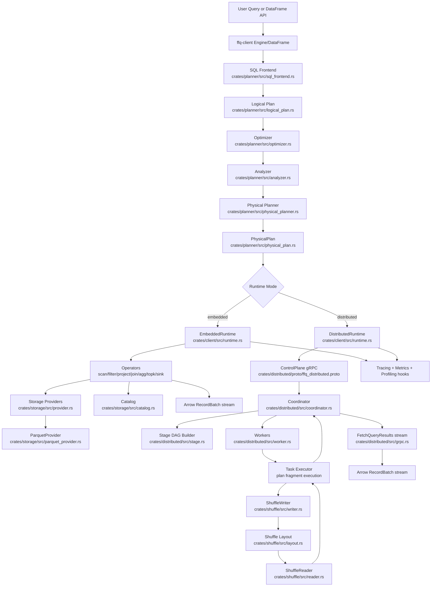

# FFQ v2 System Architecture (Bootstrap)

- Status: draft
- Owner: @ffq-docs
- Last Verified Commit: TBD
- Last Verified Date: TBD
- Source: inherited/adapted from prior version docs; v2 verification pending

This document bootstraps the v2 architecture docs from prior implementation notes across SQL frontend, analyzer/optimizer, physical planner, execution, storage, shuffle, and distributed coordinator/worker flow.

## End-to-End Diagram

## Main Components

1. Client/API layer
- Entry points: `Engine` and `DataFrame` in `crates/client/src/engine.rs` and `crates/client/src/dataframe.rs`.
- `DataFrame::execute_with_schema` drives optimize/analyze -> physical planning -> runtime execution.

2. Planner pipeline
- SQL to logical plan: `crates/planner/src/sql_frontend.rs`.
- Logical model: `crates/planner/src/logical_plan.rs`.
- Rule-based optimization and vector rewrite/fallback logic: `crates/planner/src/optimizer.rs`.
- Analysis (resolution/types/checks): `crates/planner/src/analyzer.rs`.
- Physical lowering with exchanges and operator selection: `crates/planner/src/physical_planner.rs`.

3. Runtime and operators
- Runtime abstraction: `Runtime` trait in `crates/client/src/runtime.rs`.
- Embedded runtime executes the physical tree directly.
- Distributed runtime submits plan to coordinator and fetches results via gRPC.
- Core operator execution is implemented in `crates/client/src/runtime.rs` (embedded) and `crates/distributed/src/worker.rs` (distributed task execution).

4. Storage and catalog
- Storage provider abstraction: `crates/storage/src/provider.rs`.
- Parquet implementation: `crates/storage/src/parquet_provider.rs`.
- Table metadata and persistence: `crates/storage/src/catalog.rs`.

5. Distributed control and shuffle
- Protos/services: `crates/distributed/proto/ffq_distributed.proto`, `crates/distributed/src/grpc.rs`.
- Coordinator state machine and scheduling: `crates/distributed/src/coordinator.rs`.
- Stage cutting at shuffle boundaries: `crates/distributed/src/stage.rs`.
- Worker polling/task execution/resource controls: `crates/distributed/src/worker.rs`.
- Shuffle file format/index/read path: `crates/shuffle/src/layout.rs`, `crates/shuffle/src/writer.rs`, `crates/shuffle/src/reader.rs`.

6. Observability
- Metrics registry and Prometheus exposition: `crates/common/src/metrics.rs`.
- Metrics exporter (`/metrics`) for profiling/ops path: `crates/common/src/metrics_exporter.rs`.
- Tracing spans in runtime/coordinator/worker paths.

## Request Lifecycle Narrative

A query starts in `Engine::sql(...)` and is wrapped in a `DataFrame`. When `collect()` (or write API) is called, FFQ reads catalog metadata, then runs the planner pipeline in this order: SQL frontend output (or DataFrame logical plan) -> optimizer rewrites -> analyzer resolution/type checks -> physical plan generation.

At this point execution diverges by runtime mode:

1. Embedded mode
- `EmbeddedRuntime` executes the physical plan tree in-process.
- Scan operators call storage providers (parquet first) to produce Arrow batches.
- Relational operators (filter/project/join/aggregate/top-k/limit/sink) transform batches.
- Spill and metrics/tracing hooks are applied during heavy operators.
- Final batches are returned directly to the client stream and collected.

2. Distributed mode
- `DistributedRuntime` submits serialized physical plan over gRPC to coordinator.
- Coordinator builds a stage DAG by cutting at `ShuffleRead` boundaries and schedules tasks via worker pull (`GetTask`).
- Workers execute assigned plan fragments using the same execution semantics as embedded execution.
- Shuffle-producing stages write Arrow IPC partition files + index; downstream stages read them via shuffle fetch/read APIs.
- Workers report task status and map outputs; coordinator tracks query state and stage/task metrics.
- Final-stage results are registered with coordinator and streamed back to the client via `FetchQueryResults`.

In both modes, the output contract is Arrow `RecordBatch` streams, and observability is attached through tracing fields (`query_id`, `stage_id`, `task_id`, `operator`) and Prometheus metrics.
